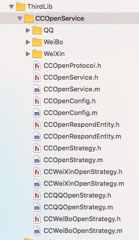

# CC轻量级开放平台服务

## 更新说明
　　2016年10月26日 **1.新增支持接口;**  
　　2016年09月12日 **1.新增获取authCode接口;**

## 前言
　　提供第三方开放平台的集成服务,一句代码实现一种功能~喜欢的朋友可以前来点个小星星
## 特色
　　目前市面上提供的第三方SDK,相当繁琐臃肿,还需要去他们的集成平台上注册各种key之类的,相当麻烦.**CC轻量级开放平台服务**提供一行代码请求数据服务,底层集成了各平台SDK,用户无需关心具体平台的实现,省事省心.

## 主要功能
1. 集成微信,QQ,微博的开放平台SDK.
2. 提供统一的请求入口,一句代码即可完成任务,简单高效.
3. 目前支持开放平台登录,支付功能接入,其他功能(分享,收藏,评论等)后期有时间会更新上.
4. 支持单独获取OAuth 2.0中的access_token(微信为code),提升安全性.

## 使用方法
1 直接将整个目录拖到你的项目中.(注意用group形式,目录会显示成黄色).本库用到AFNetworking,需要自己集成.

   
      
2 在AppDelegate.m文件顶部引入头文件CCOpenService.h,CCOpenConfig.h,并且写入下面的配置信息(注意,类似WeiXinAppID这样的,填写自己的微信appID)

``` objectivec
//AppDelegate.m
- (BOOL)application:(UIApplication *)application didFinishLaunchingWithOptions:(NSDictionary *)launchOptions {
    //微信配置
    [CCOpenConfig setWeiXinAppID:WeiXinAppID];
    [CCOpenConfig setWeiXinAppSecret:WeiXinAppSecret];
    
    //QQ配置
    [CCOpenConfig setQQAppID:QQAppID];
    [CCOpenConfig setQQAppKey:QQAppKey];
    
    //微博配置
    [CCOpenConfig setWeiBoAppKey:WeiBoAppKey];
    [CCOpenConfig setWeiBoAppSecret:WeiBoAppSecret];
    [CCOpenConfig setWeiBoRedirectURI:WeiBoRedirectURI];
    
    return YES;
}

-(BOOL)application:(UIApplication *)application handleOpenURL:(NSURL *)url{
    //配置微信,QQ,新浪
    CCOpenService *wxService = [CCOpenService getOpenServiceWithName:CCOpenServiceNameWeiXin];
    CCOpenService *qqService = [CCOpenService getOpenServiceWithName:CCOpenServiceNameQQ];
    CCOpenService *wbService = [CCOpenService getOpenServiceWithName:CCOpenServiceNameWeiBo];
    return [wxService handleOpenURL:url] || [qqService handleOpenURL:url] || [wbService handleOpenURL:url];
}

-(BOOL)application:(UIApplication *)application openURL:(NSURL *)url sourceApplication:(NSString *)sourceApplication annotation:(id)annotation{
    //配置微信,QQ,新浪
    CCOpenService *wxService = [CCOpenService getOpenServiceWithName:CCOpenServiceNameWeiXin];
    CCOpenService *qqService = [CCOpenService getOpenServiceWithName:CCOpenServiceNameQQ];
    CCOpenService *wbService = [CCOpenService getOpenServiceWithName:CCOpenServiceNameWeiBo];
    return [wxService handleOpenURL:url] || [qqService handleOpenURL:url] || [wbService handleOpenURL:url];
}
```

3 参考各个平台关于URL scheme的配置指南.例如微信:


4 iOS9 设备需要添加白名单,参考[iOS9白名单](https://github.com/ChenYilong/iOS9AdaptationTips)

## 接口使用说明
　　服务类型目前支持CCOpenServiceNameWeiXin,CCOpenServiceNameQQ,CCOpenServiceNameWeiBo

### 第三方登录接口

``` objective
//微信登录
CCOpenService *wxService = [CCOpenService getOpenServiceWithName:CCOpenServiceNameWeiXin];
[wxService requestOpenAccount:^(CCOpenRespondEntity *respond) {
    if (respond == nil) {
        UIAlertView *alert = [[UIAlertView alloc] initWithTitle:@"温馨提示" message:@"^_^亲,您木有安装微信哟~ " delegate:nil cancelButtonTitle:@"知道啦" otherButtonTitles:nil];
        [alert show];
        return;
    }
    NSLog(@"Respond data is %@",respond.data);
}];
```

### 获取第三方AuthCode接口
``` objective
// 如果需求里对第三方登录功能有着更为严格的安全要求时,可以只获取到access_token(微信为code),此接口只需要平台的申请到的帐号id(或者key)而不需要密钥(或者secret)即可实现,获取到authcode之后发给服务端,由服务端处理获取用户个人openid和其他信息部分的业务逻辑即可~
CCOpenService *wxService = [CCOpenService getOpenServiceWithName:CCOpenServiceNameWeiXin];
[wxService requestOpenAuthCode:^(CCOpenRespondEntity *respond) {
    if (respond == nil) {
        UIAlertView *alert = [[UIAlertView alloc] initWithTitle:@"温馨提示" message:@"^_^亲,您木有安装微信哟~ " delegate:nil cancelButtonTitle:@"知道啦" otherButtonTitles:nil];
        [alert show];
        return;
    }
    NSLog(@"Respond data is %@",respond.data);
}];
```

### 支付功能
　　工作项目关系,目前只支持微信支付.  
　　**注意,微信支付务必将全局统一下单步骤安排到服务端完成,再由服务端返回唤起微信客户端所需要的相关参数,用以唤起微信客户端并完成支付**

``` objective
CCOpenWXPayRequestEntity *wxEntity = [[CCOpenWXPayRequestEntity alloc] init];
wxEntity.wxAppID   = <#appid#>;
wxEntity.partnerID = <#partnerid#>;
wxEntity.prepayID  = <#prepayid#>;
wxEntity.nonceStr  = <#noncestr#>;
wxEntity.timestamp = <#timestamp#>;
wxEntity.package   = @"Sign=WXPay";
wxEntity.sign      = <#sign#>;

CCOpenService *wxService = [CCOpenService getOpenServiceWithName:CCOpenServiceNameWeiXin];
[wxService requestPay:wxEntity respondHander:^(CCOpenRespondEntity *respond) {
    NSString *payResult = respond.data[@"result"];
    if ([payResult isEqualToString:@"WXSuccess"]) {
            // Query the result of payment from service..
            //Do something
    }else if([payResult isEqualToString:@"WXErrCodeUserCancel"]) {
        //User cancel
    }else {
        //Error~
    }
    NSLog(@"%@",respond.data);
}];
```

## 其他说明
　　WeiXin,QQ,WeiBo目录下的SDK需要手动导入,另外第三方平台的SDK可能需要手动导入一些类库,具体的先参考具体平台的官方说明,有空更新上.  
　　本人工作忙,所以很多功能还没时间写上.目前已经写好了整体框架,有兴趣的同学可当作自己学习锻炼机会,参考我的源码设计模式,将新增的功能Pull Request给我,谢谢.